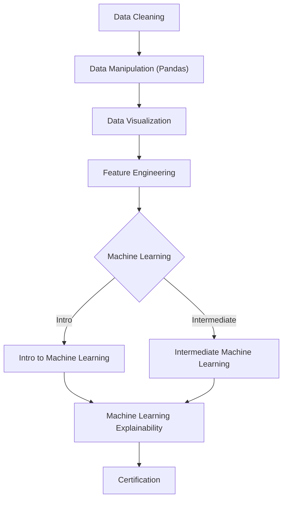

# Technical Specification: Kaggle

## Architectural Overview

**Kaggle** is a structured, linear progression architecture designed to systematically build data science and machine learning competency through a rigorous series of Kaggle courses. The project serves as a comprehensive study into the **Python Data Science Ecosystem**, bridging the gap from data cleaning fundamentals to advanced feature engineering and machine learning explainability.

### Learning Logic Flow

---

## Technical Implementations

### 1. Core Computational Engine
-   **Runtime Environment**: Built on **Python 3.x**, utilizing the **SciPy** stack for scientific computation and **Standard Library** for core application logic.
-   **Interactive Development**: Emphasizes Kaggle's cloud-based Jupyter Notebook environment for hands-on learning and reproducible experimentation.

### 2. Modules & Libraries
-   **Data Wrangling**: Implements **`pandas`** and **`numpy`** for high-performance data manipulation, array processing, and numerical analysis.
-   **Visual Synthesis**: Utilizes **`matplotlib`** and **`seaborn`** to construct insightful, publication-quality visualizations for exploratory data analysis (EDA).
-   **Machine Learning**: Deploys **`scikit-learn`** for designing robust predictive models and **`xgboost`** for gradient boosting implementations.

### 3. Course Framework
-   **Data Cleaning**: Handling missing values, parsing dates, character encodings, and inconsistent data entry.
-   **Data Manipulation**: Mastering pandas for indexing, grouping, sorting, and data type management.
-   **Data Visualization**: Creating bar charts, heatmaps, scatter plots, line charts, and distribution visualizations.
-   **Feature Engineering**: Mutual information, clustering, principal component analysis, and target encoding.
-   **Machine Learning**: Linear regression, decision trees, random forests, cross-validation, pipelines, and XGBoost.
-   **ML Explainability**: Permutation importance, partial dependence plots, and SHAP values.

---

## Technical Prerequisites

-   **Runtime**: Python 3.7 or higher ([Python.org](https://www.python.org/)).
-   **Development**: Kaggle Notebooks, Jupyter Notebook, Google Colab, or Anaconda Distribution.
-   **Dependencies**: Valid `pip install` synchronization for pandas, numpy, sklearn, matplotlib, seaborn, and xgboost suites.

---

*Technical Specification | Kaggle | Version 1.0*
